# Análisis lingüístico en apoyo a la traducción de textos utilizando NLP
*******

Este proyecto se busca apoyar al problema de traducir textos escritos en una lengua desconocida. Ante lo cual, se desarrolló un proceso bajo el lenguaje de programación <strong>"Python"</strong> en su versión <strong>"3.6.8"</strong>, en donde se adopta a la <strong>Distancia de Levenshtein</strong> y se implementa una <strong>Red Neuronal Artificial (RNA)</strong> para la traducción de verbos. Esto, conforme en la siguiente hipótesis:

 
<ul>
  <li>
 Utilizando la <strong>Distancia de Levenshtein</strong> para ubicar la posición de un determinado verbo en un texto escrito bajo un idioma conocido, donde todos los caracteres previos y posteriores al verbo formen dos palabras completas, y la distancia entre el verbo y ambas palabras comprendan la posición del verbo en el texto; se considera posible que, bajo un proceso similar, se pueda determinar la posición de la palabra equivalente al verbo revisado en un texto escrito bajo un idioma desconocido.
  
</li>
</ul>

Por ejemplo, como se observa en la siguiente imagen, si un verbo en un texto escrito en inglés ocupa una posición específica, descrita por la distancia entre el verbo revisado y la palabra <strong>"Y"</strong> del lado izquierdo y la palabra <strong>"X"</strong> del lado derecho, entonces la traducción de este verbo podría ocupar una posición relativamente similar en un texto escrito en otro idioma, como es el español.

 

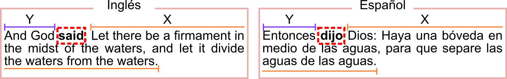

## Requerimientos de ejecución

El proyecto, como se mencionó antes, fue realizado en <strong>"Python"</strong> y para su ejecución se requiere descargar e instalar los siguientes componentes:

 
<ol>
  <li>
Descargar e instalar <strong>Python 3</strong> o superior.
  
</li>
  <li>
En Python, instalar las librerías:
    <ul>
      <li>
spacy, y descargar con él, los paquetes:
        <ul>
          <li>
"en_core_web_md"
          
</li>
          <li>
"es_core_news_md"
          
</li>
        </ul>
      
</li>
      <li>
numpy
      
</li>
      <li>
pandas
      
</li>
      <li>
sklearn
      
</li>
      <li>
nltk y descargar con él, los paquetes:
        <ul>
          <li>
punkt
          
</li>
          <li>
stopwords
          
</li>
        </ul>
      
</li>
      <li>
keras
      
</li>
      <li>
xml
      
</li>
      <li>
matplotlib
      
</li>
      <li>
mpl_toolkits
      
</li>
    </ul>
  
</li>
  <li>
Descargar los archivos y carpetas:
    <ul>
      <li>
Archivo <strong>"1_XmlToCsv.py"</strong>
      
</li>
      <li>
Archivo <strong>"2_CsvToRofV.py"</strong>
      
</li>
      <li>
Archivo <strong>"3_RofVToRNA.py"</strong>
      
</li>
      <li>
Archivo <strong>"4_CsvOnRNA.py"</strong>
      
</li>
      <li>
Archivo <strong>"5_TxtOnRNA.py"</strong>
      
</li>
      <li>
Carpeta <strong>"1_BibliaParalelo"</strong> con:
        <ul>
          <li>
Archivo <i>"__MiniEng.xml"</i>
          
</li>
          <li>
Archivo <i>"__MiniSpa.xml"</i>
          
</li>
          <li>
Archivo <i>"English.xml"</i>
          
</li>
          <li>
Archivo <i>"Spanish.xml"</i>
          
</li>
          <li>
Archivo <i>"__TEXTO_Eng.txt"</i>
          
</li>
          <li>
Archivo <i>"__TEXTO_Spa.txt"</i>
          
</li>
        </ul>
      
</li>
      <li>
Carpeta <strong>"zLibs"</strong> con:
        <ul>
          <li>
Archivo <i>"__init__.py"</i>
          
</li>
          <li>
Archivo <i>"Funciones.py"</i>
          
</li>
        </ul>
      
</li>
    </ul>
  
</li>
  <li>
Preparar una carpeta con nombre <strong>"2_Resultados"</strong> en el mismo nivel a los archivos y carpetas descargados.
  
</li>
</ol>

## Funcionamiento de aplicación

El funcionamiento y ejecución de este proyecto sigue el orden descrito por el nombre y número de cada archivo <strong>".py"</strong>. Por lo cual, como se muestra en la siguiente imagen, es necesario que todos estos archivos se encuentren en una misma carpeta.

 

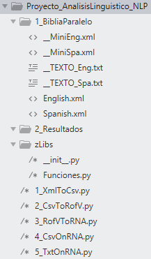

 

La ejecución de cada archivo se puede realizarse desde la consola o terminal, con la instrucción <strong>"Prop&gt; python3 nombreDelArchivo.py"</strong>. Posteriormente, el resultado de cada paso será guardado en la carpeta <strong>"2_Resultados"</strong> con un nombre alusivo a su contenido y el número de archivo <strong>".py"</strong> ejecutado. Ante lo cual, es importante saber que los archivos:

 
<ul>
  <li>
<strong>English.xml:</strong> Contiene aproximadamente 31,000 versos de la biblia en idioma inglés.
  
</li>
  <li>
<strong>Spanish.xml:</strong> Contiene aproximadamente 31,000 versos de la biblia en idioma español.
  
</li>
  <li>
<strong>__MiniEng.xml:</strong> Es una muestra del archivo <i>"English.xml"</i> y contiene 80 versos en inglés.
  
</li>
  <li>
<strong>__MiniSpa.xml:</strong> Es una muestra del archivo <i>"Spanish.xml"</i> y contiene 80 versos en español.
  
</li>
  <li>
<strong>__TEXTO_Eng.xml:</strong> Contiene un verso en idioma inglés.
</li>
  <li>
<strong>__TEXTO_Spa.xml:</strong> Contiene un verso en idioma español.
</li>
</ul>

Así, cada uno de los archivos <strong>".py"</strong> realiza una función diferente, necesaria para la ejecución del archivo subsecuente a él, y para el objetivo del proyecto. Esto, de la siguiente forma:

 
<ol>
  <li>
<strong>Archivo "1_XmlToCsv.py":</strong>
    <ul>
      <li>
Procesa los versos contenidos en los archivos <i>".xml"</i> de la carpeta "1_BibliaParalelo" indicados por las variables <i>"rutaArchivoEng"</i> y <i>"rutaArchivoSpa"</i> del archivo <i>"1_XmlToCsv.py"</i>.
      
</li>
      <li>
Tras procesar los versos de los archivos <i>".xml"</i>, se generan dos archivos <i>".csv"</i> (Eng y Spa) con los versos listos para su posterior análisis.
      
</li>
      <li>
Tambien, tras procesar los versos, se generan dos resúmenes <i>".json"</i> (Eng y Spa) de los verbos encontrados, las formas sobre cómo se encontró y el número de apariciones que tuvo cada verbo revisado.
      
</li>
    </ul>
  
</li>
  <li>
<strong>Archivo "2_CsvToRofV.py":</strong>
    <ul>
      <li>
Toma los archivos <i>".csv"</i> que se generaron antes, se calcula la posición de un conjunto determinado de verbos con respecto de su distancia, en contra del conjunto de tokens a la izquierda y derecha de cada uno. En donde, los verbos analizados, para este caso, fueron los siguientes:
        <ul>
          <li>
Para el idioma inglés: "give", "say", "have" y "come".
          
</li>
          <li>
Para el idioma español: "dar", "decir", "tener" y "venir".
          
</li>
        </ul>
      
</li>
      <li>
Una vez calculada la posición de cada verbo revisado, se generan dos archivos <i>".csv"</i> con la distancia de cada verbo a su izquierda y derecha (Eng_Datos y Spa_Datos), en conjunto a otros dos archivos <i>".csv"</i> (Eng_Verbos y Spa_Verbos) con los verbos y formas encontradas de cada uno, para conocer que verbo corresponde cada distancia en los archivos anteriores (Eng_Datos y Spa_Datos).
      
</li>
      <li>
Finalmente, se generan dos gráficos de puntos, con las distancias izquierda (para el eje Y) y derecha (para el eje X) calculadas respecto de los verbos analizados, en conjunto a un archivo <i>".txt"</i> con anotaciones sobre a qué verbo corresponde que color en el gráfico.
      
</li>
    </ul>
  
</li>
  <li>
<strong>Archivo "3_RofVToRNA.py":</strong>
    <ul>
      <li>
Toma los archivos <i>".csv"</i> respecto de las distancias antes calculadas y los verbos que les corresponden, para generar una RNA, en donde los datos <i>Eng</i> se utilizan para entrenar a la RNA y los datos <i>Spa</i> se usan para validarla.
      
</li>
      <li>
Una vez generada la RNA se guarda su modelo en un archivo <i>".h5"</i>, en conjunto a tres notas <i>".txt"</i>:
        <ul>
          <li>
Dos notas con la equivalencia numérica da cada verbo procesado por la RNA.
          
</li>
          <li>
Una sola nota con el porcentaje de precisión y perdida de la RNA generada.
          
</li>
        </ul>
      
</li>
    </ul>
  
</li>
  <li>
<strong>Archivo "4_CsvOnRNA.py":</strong>
    <ul>
      <li>
Carga el modelo de RNA <i>".h5"</i>, junto a los datos de validación utilizados al generar la RNA, y entonces, se generan dos gráficos de puntos con una proyección de los verbos predichos, distinguiendo a cada uno por un color diferente.
      
</li>
    </ul>
  
</li>
  <li>
<strong>Archivo "5_TxtOnRNA.py":</strong>
    <ul>
      <li>
Carga el modelo de RNA <i>".h5"</i>, junto con el archivo <i>".txt"</i> de la carpeta <i>"1_BibliaParalelo"</i> indicado por la variable <i>"rutaArchivoTXT"</i> del archivo <i>"5_TxtOnRNA.py"</i>.
      
</li>
      <li>
Genera un archivo <i>".json"</i> con un token (palabra), el número correspondiente al verbo que la RNA encontró equivalente, y la precisión con lo cual determino todo esto.
      
</li>
    </ul>
  
</li>
</ol>

## Resultados obtenidos

Este proyecto se revisó si a través del cálculo de la posición de verbos en un idioma objetivo, basándose en la <strong>Distancia de Levenshtein</strong>, era posible conseguir en una posición relativamente similar de una palabra equivalente en otro idioma al verbo revisado, como se observa en la siguiente imagen.

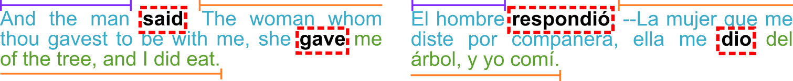

Ante lo cual, se desarrolló una RNA alimentada con el cálculo de las posiciones de cuatro verbos en una serie de versos, y se validó con las posiciones calculadas para estos mismos verbos, pero en español. En donde, los verbos analizados fueron los siguientes:

 
<ul>
  <li>
Para el idioma inglés: "give", "say", "have" y "come".
  
</li>
  <li>
Para el idioma español: "dar", "decir", "tener" y "venir".
  
</li>
</ul>

Posteriormente, se realizaron 2 pruebas, la primera sobre una muestra de versos en inglés y en español, y la segunda con el total de versos en estos mismos idiomas.

### Primer prueba 

En la primera prueba se hizo uso de los archivos <strong>"__MiniEng.xml"</strong> (muestra de versos en inglés) y <strong>"__MiniSpa.xml"</strong> (muestra de versos en español), como fuente de datos para trabajar. En donde, solo se contempló a tres de los cuatro verbos antes mencionados, de acuerdo en la relación "Color - Verbo" y "Número - Verbo", descrita por la siguiente tabla:

 

|Verbo en inglés|Verbo en español|Color|Número|
|------|-----|-----|------|
|Say|Decir|Rojo|1|
|Give|Dar|Azul|2|
|Have|Tener|Verde|3|

Esta relación se puede observar en las siguientes imagenes, enmarcando a la distancia izquierda y derecha de la siguiente forma:

 

<ul>
  <li>
<strong>Eje Y:</strong> Distancia a la izquierda.
  
</li>
  <li>
<strong>Eje X:</strong> Distancia a la derecha.
  
</li>
</ul>

Ante lo cual, sobre la distribución de las posiciones de los verbos en inglés y español, se encontró lo siguiente:

 

<ul>
  <li>
<strong>En inglés:</strong>
    <ul>
      <li>
El verbo <i>"Say"</i> tendió a una menor distancia a la izquierda y mayor distancia a la derecha.
      
</li>
      <li>
El verbo <i>"Give"</i> tuvo mayor distribución hacia la izquierda o derecha, pero nunca de forma equilibrada, por lo que, se puede decir que el verbo no tendió a adoptar una posición central en el texto.
      
</li>
      <li>
El verbo <i>"Have"</i> tuvo una distribución dispersa, así que, no fue posible ver en él algún tipo de tendencia.
      
</li>
    </ul>
  
</li>
</ul>

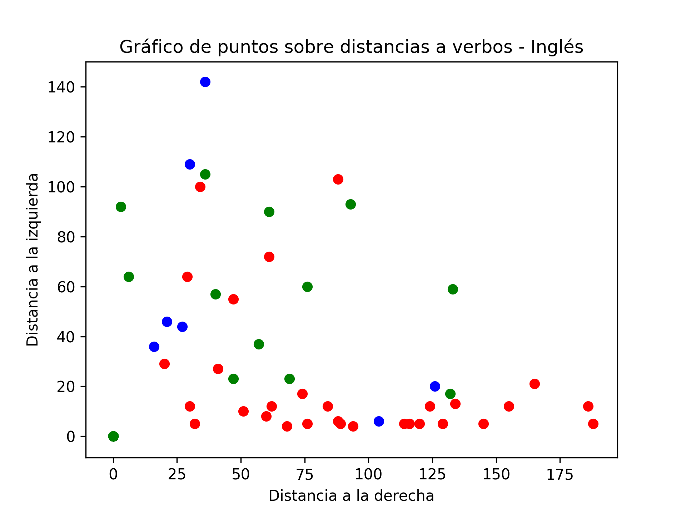

 

<ul>
  <li>
<strong>En español:</strong>
    <ul>
      <li>
El verbo <i>"Decir"</i> tendió a una distancia menor del lado izquierdo y a una distancia mayor del lado derecho.
      <li>
El verbo <i>"Dar"</i> tuvo una distribución dispersa, por lo que no fue posible ver en él algún tipo de tendencia.
      
</li>
      <li>
El verbo <i>"Tener"</i> tuvo una posición equilibrada, por lo que podemos decir que tendía a una posición central en el texto.
      
</li>
    </ul>
  
</li>
</ul>

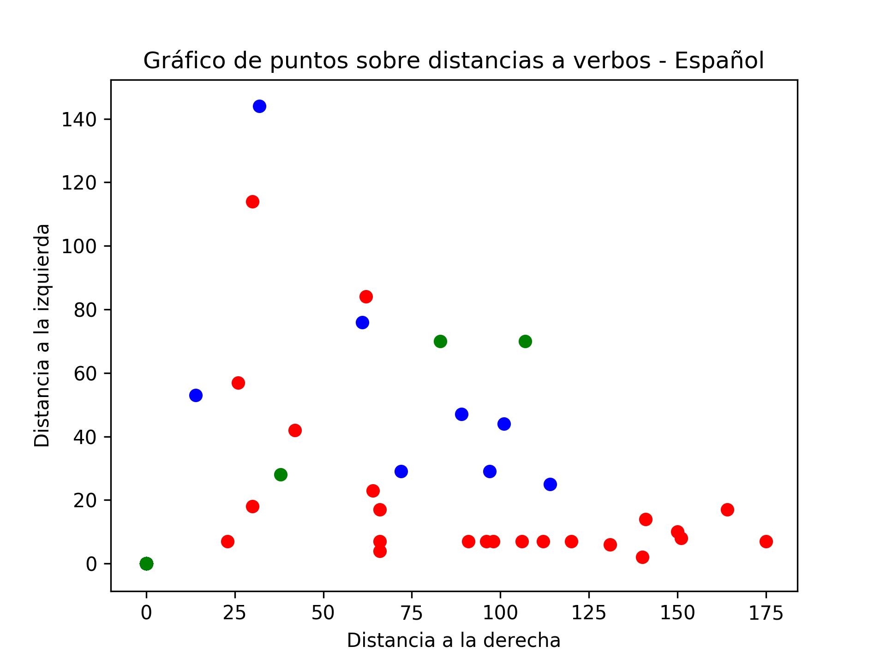

 

Sin embargo, a pesar de las distinciones encontradas para cada verbo, expuestas por los gráficos anteriores, al validar a la RNA con las distancias en idioma español e inglés utilizadas en el entrenamiento de este mecanismo, se consiguió lo siguiente:

 

<ul>
  <li>
<strong>En inglés:</strong>
    <ul>
      <li>
Con el verbo <i>"Say"</i> la RNA pareció tener buena precisión.
      
</li>
      <li>
Con el verbo <i>"Give"</i>, la RNA lo confundió con el verbo <i>"Have"</i>.
      
</li>
      <li>
Con el verbo <i>"Have"</i>, la RNA lo logro determinar de manera correcta, pero con baja precisión en aproximadamente la mitad de casos, y en los otros casos con un mayor grado de precisión, pero confundiendo al verbo <i>"Have"</i> con el verbo con <i>"Say"</i>.
      
</li>
    </ul>
  
</li>
</ul>

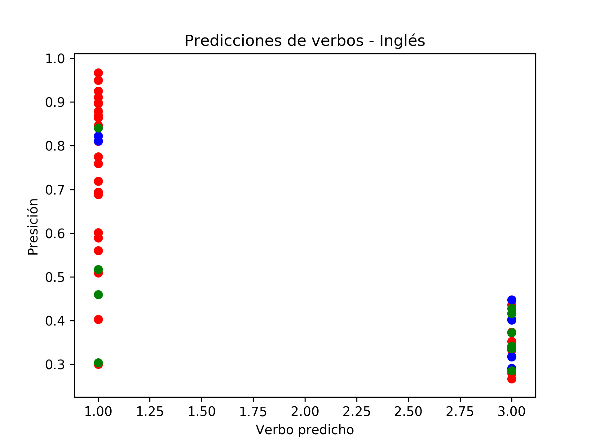

 

<ul>
  <li>
<strong>En español:</strong>
    <ul>
      <li>
Con el verbo <i>"Decir"</i> la RNA pareció tener buena precisión.
      
</li>
      <li>
Con el verbo <i>"Dar"</i>, la RNA tendió a confundirse con el verbo <i>"Decir"</i>.
      
</li>
      <li>
Con el verbo <i>"Tener"</i>, la RNA lo logro determinar de forma correcta, pero con muy baja precisión.
      
</li>
    </ul>
  
</li>
</ul>

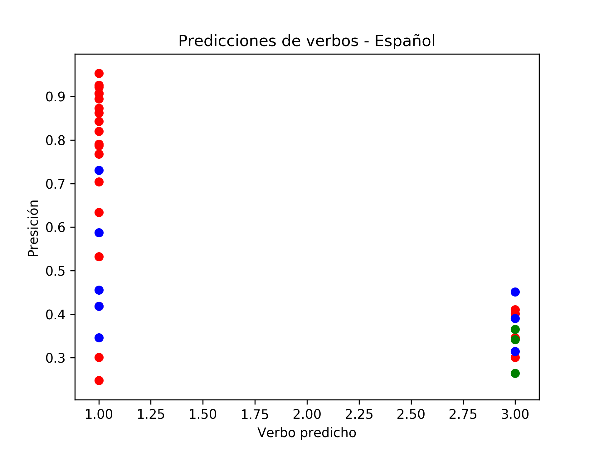

### Segunda prueba 

En la segunda prueba realiza, se utilizó como fuente de datos los archivos <strong>"English.xml"</strong> (total de versos en inglés) y <strong>"Spanish.xml"</strong> (total de versos en español), de acuerdo a la relación "Color - Verbo" y "Número - Verbo" presentada en la siguiente tabla:

|Verbo en inglés|Verbo en español|Color|Número| 
|------|-----|-----|------|
|Say|Decir|Rojo|1|
|Give|Dar|Azul|2|
|Have|Tener|Verde|3|
|Come|Venir|Naranja|4|

En donde, como se puede observar en las siguientes imagenes, se enmarcó a la distancia izquierda y derecha de la siguiente forma:

 

<ul>
  <li>
<strong>Eje Y:</strong> Distancia a la izquierda.
  
</li>
  <li>
<strong>Eje X:</strong> Distancia a la derecha.
  
</li>
</ul>

De esta forma, ante la distribución de las posiciones de los verbos en inglés y español, se encontró lo siguiente:

 

<ul>
  <li>
<strong>En inglés:</strong>
  <ul>
    <li>
El verbo <i>"Say"</i> se distribuyó de una forma que no evidenciaba tendencia hacia algún lado.
    
</li>
    <li>
El verbo <i>"Give"</i> se distribuyó de tal forma que, no evidenciaba tendencia hacia algún lado.
    
</li>
    <li>
El verbo <i>"Have"</i> se distribuyó de tal forma que, no evidenciaba tendencia hacia algún lado, aunque, presento los valores atípicos más alejados en comparación a la distribución de los otros verbos.
    
</li>
    <li>
El verbo <i>"Come"</i> se distribuyó de tal forma que, no evidenciaba tendencia hacia algún lado.
    
</li>
  </ul>
  
</li>
</ul>

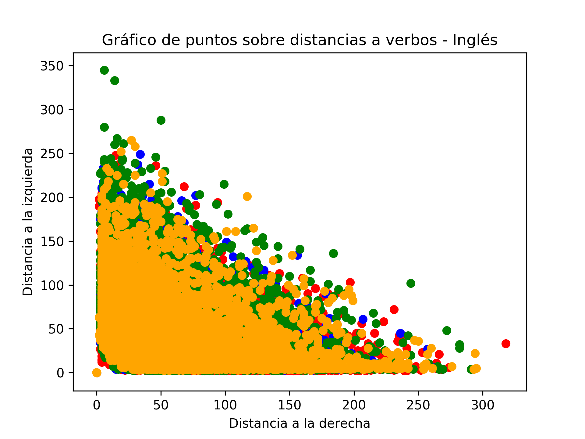

 

<ul>
  <li>
<strong>En español:</strong>
  <ul>
    <li>
El verbo <i>"Decir"</i> se distribuyó de tal forma que, no evidenciaba tendencia hacia algún lado.
    
</li>
    <li>
El verbo <i>"Dar"</i> se distribuyó de tal forma que, no evidenciaba tendencia hacia algún lado.
    
</li>
    <li>
El verbo <i>"Tener"</i> se distribuyó de tal forma que, no evidenciaba tendencia hacia algún lado.
    
</li>
    <li>
El verbo <i>"Venir"</i> se distribuyó de tal forma que, no evidenciaba tendencia hacia algún lado.
    
</li>
  </ul>
  
</li>
</ul>

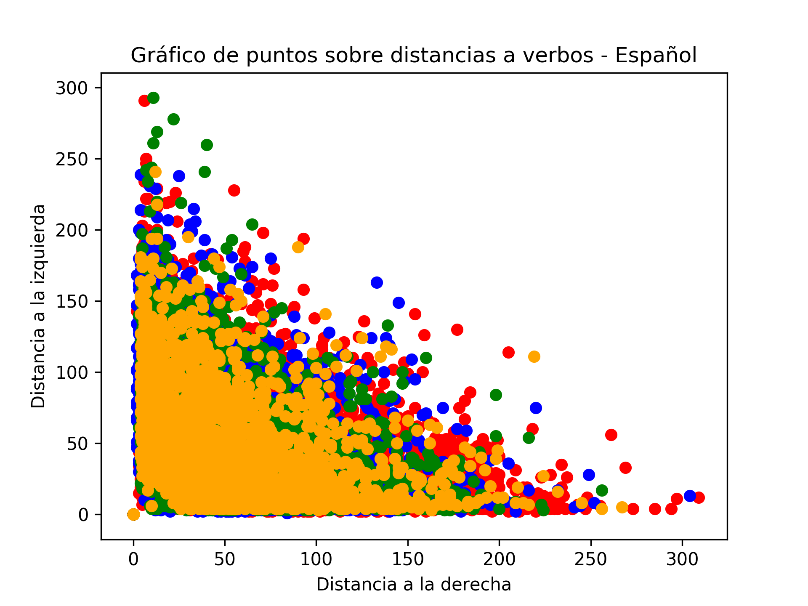

 

En relación a lo cual, no se descubrieron diferencias significativas respecto a la posición de un verbo en el texto. Demostrando así, la inviabilidad de la hipótesis planteada en el proyecto, sobre la localización de un verbo con base en la <strong>Distancia de Levenshtein</strong>. No obstante, pese a estos resultados, a través de la RNA entrenada con versos en idioma inglés y español, se consiguió lo siguiente:

 

<ul>
  <li>
<strong>En inglés:</strong>
  <ul>
    <li>
Con el verbo <i>"Say"</i> la RNA pareció tener buena precisión.
    
</li>
    <li>
Con el verbo <i>"Give"</i> la RNA tendió a confundirse con el verbo <i>"Say"</i>.
    
</li>
    <li>
Con el verbo <i>"Have"</i> la RNA lo logro determinar, pero con baja precisión.
    
</li>
    <li>
Con el verbo <i>"Come"</i> la RNA tendió a confundirse con el verbo <i>"Say"</i> y tambien con el verbo <i>"Have"</i>, aunque con baja precisión.
    
</li>
  </ul>
  
</li>
</ul>

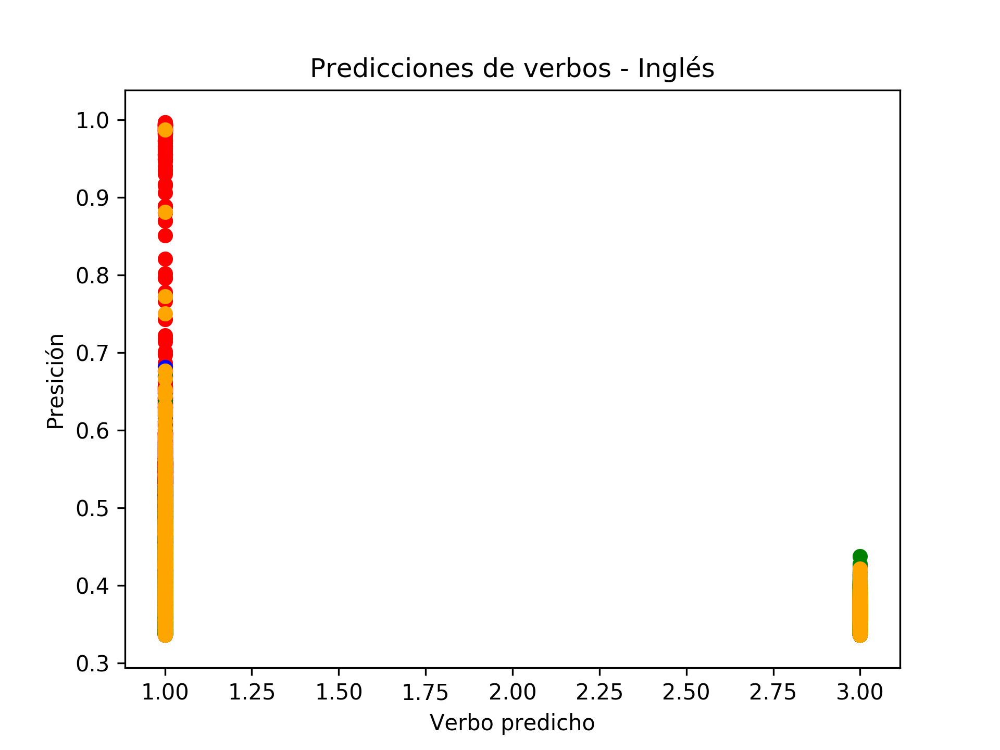

 

<ul>
  <li>
<strong>En español:</strong>
  <ul>
    <li>
Con el verbo <i>"Decir"</i> la RNA pareció tener buena precisión.
    
</li>
    <li>
Con el verbo <i>"Dar"</i> la RNA tendió a confundirse con el verbo <i>"Decir"</i>.
    
</li>
    <li>
Con el verbo <i>"Tener"</i> la RNA tendió a confundirse con el verbo <i>"Decir"</i>.
    
</li>
    <li>
Con el verbo <i>"Venir"</i> la RNA tendió a confundirse con el verbo <i>"Decir"</i> y tambien con el verbo <i>"Tener"</i>, aunque con baja precisión.
    
</li>
  </ul>
  
</li>
</ul>

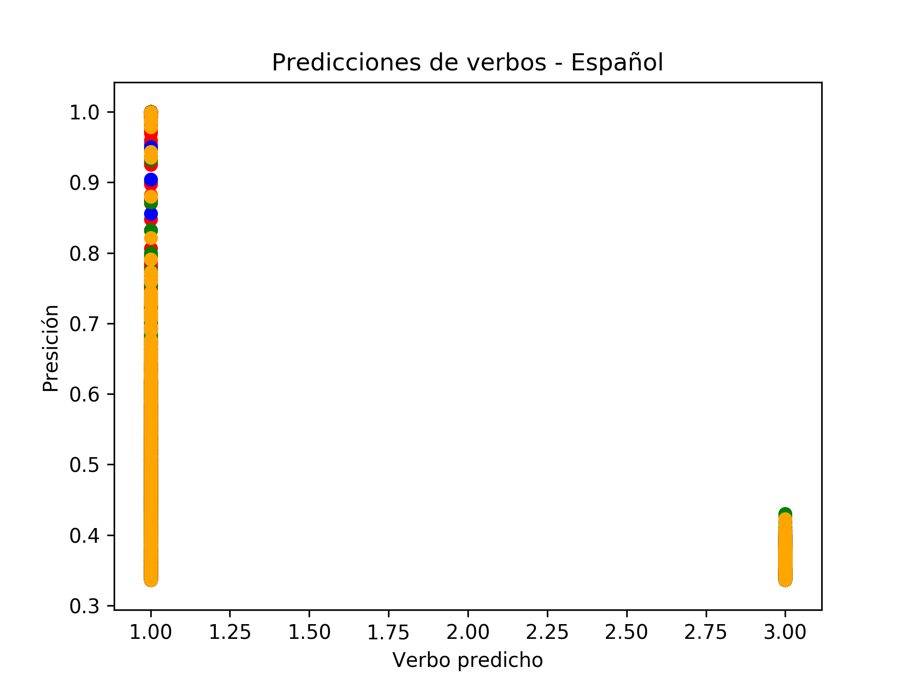

*******
## Créditos

Autor: *Jorge Luis Jácome Domínguez*

######  Otros medios < [Linkedin](https://www.linkedin.com/in/jorge-luis-j%C3%A1come-dom%C3%ADnguez-44294a91/) - [Dibujando](https://dibujando.net/soragefroren) - [Facebook](https://www.facebook.com/SoraGefroren) - [Youtube](https://www.youtube.com/c/SoraGefroren) >
